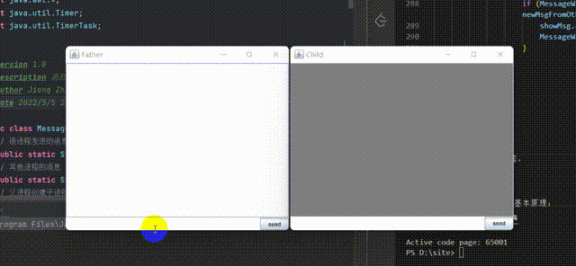

## 一、理论分析

进程直接实现通信的方式有许多种，如**共享内存、消息传递、共享文件**等等。其中，共享文件的形式可以通过**管道**来实现。

管道是一种**信息流缓冲机构**，本质上是一个**线性字节数组**，可以以文件读写的方式访问，但它不是文件。

管道包括了**匿名管道和命名管道**，前者主要用于本地父子进程的通信，而后者则主要用于网络传输。

本实验内容是在父子进程之间通过匿名管道的形式进行通信，通过**Java语言**实现。

## 二、设计与实现

### 1.父进程创建子进程

1. 运行**Father.java**，建立父进程，开启父进程通信窗口，通过窗口静态变量**createTag**（初始值为false）监视用户操作；
2. 用户通过点击按钮创建子进程，**createTag**置为true，父进程监测到后建立子进程，子进程开启通信窗口。父子进程都建立管道输入输出流。

父进程相关代码如下：

```java
Father father = new Father();
MessageWindow window = new MessageWindow("Father", 0);
BufferedWriter bw;
BufferedReader br;
// 检测是否创建子进程
while (true) {
    synchronized (MessageWindow.class) {
        if (MessageWindow.createTag) {
            father.createChildProcess();
            bw = new BufferedWriter(new OutputStreamWriter(father.getChild().getOutputStream(), StandardCharsets.UTF_8));
            br = new BufferedReader(new InputStreamReader(father.getChild().getInputStream(), StandardCharsets.UTF_8));
            break;
        }
        if (!window.isVisible()) {
            System.exit(0);
        }
    }
}
```

子进程相关代码如下：

```java
MessageWindow window = new MessageWindow("Child", 1);
BufferedReader br = new BufferedReader(new InputStreamReader(System.in, StandardCharsets.UTF_8));
BufferedWriter bw = new BufferedWriter(new OutputStreamWriter(System.out, StandardCharsets.UTF_8));
```

创建子进程代码如下：

```java
public void createChildProcess() throws IOException {
    Runtime run = Runtime.getRuntime();
    // 获取java执行命令所在的位置
    String java = System.getProperty("java.home") + File.separator + "bin" + File.separator + "java";
    // 获取类加载的时候的加载的class文件的路径,返回结果是一个string,多个路径之间用";"分割.
    String cp = "\"" + System.getProperty("java.class.path");
    // 获取当前程序的class文件所在的位置
    cp += File.pathSeparator + ClassLoader.getSystemResource("").getPath() + "\"";
    // java -cp 命令   (这是运行class文件的命令,会将class文件载入jvm)
    String cmd = java + " -cp " + cp + " com.jzh.Child";
    // 开启一个子进程
    child = run.exec(cmd);
}
```

### 2.父子进程通信

1. 父子进程实时监听对方是否发送消息（通过**TimerTask**实现），如果监听到则更新通过窗口静态变量**newMsgFromOther**（初始值为null），自己的通信窗口监听到该变量有值后则渲染数据并重置该变量为null；
2. 父子进程通过窗口静态变量**mySendMsg**（初始值为null）监听用户是否发送消息，如果监听到通过管道向对方写数据，并重置该变量为null。

相关代码如下：

```java
Timer timer1 = new Timer();
Timer timer2 = new Timer();
// 检测是否接收消息
timer1.schedule(new TimerTask() {
    @Override
    public void run() {
        if (father.getChild() != null) {
            Common.receiveMsg(br);
        }
    }
}, 0, 500);
// 检测是否发送消息
timer2.schedule(new TimerTask() {
    @Override
    public void run() {
        if (father.getChild() != null) {
            Common.sendMsg(bw);
        }
    }
}, 0, 500);
```

发送消息和接收消息的实现代码如下：

```java
/**
 * @version 1.0
 * @description 共同代码
 * @Author Jiang Zhihang
 * @Date 2022/5/9 22:51
 */
public class Common {
    /**
     * @description: 接收消息
     * @author Jiang Zhihang
     * @date 2022/5/9 22:59
     */
    public static void receiveMsg(BufferedReader br) {
        try {
            if (MessageWindow.newMsgFromOther == null) {
                String s = br.readLine();
                synchronized (MessageWindow.class) {
                    MessageWindow.newMsgFromOther = s;
                }
            }
        } catch (Exception e) {
            e.printStackTrace();
        }
    }
    /**
     * @description: 发送消息
     * @author Jiang Zhihang
     * @date 2022/5/9 22:59
     */
    public static void sendMsg(BufferedWriter bw) {
        try {
            if (MessageWindow.mySendMsg != null && !MessageWindow.mySendMsg.equals("")) {
                bw.write(MessageWindow.mySendMsg);
                bw.flush();
                synchronized (MessageWindow.class) {
                    MessageWindow.mySendMsg = null;
                }
            }
        } catch (Exception e) {
            e.printStackTrace();
        }
    }
}
```

### 3.结束通信

通过关闭窗口结束通信，进程监听窗口变化，一旦关闭则停止所有监听任务，并关闭流，退出进程。

相关代码如下：

```java
/**
 * @version 1.0
 * @description 共同代码
 * @Author Jiang Zhihang
 * @Date 2022/5/9 22:51
 */
public class Common {
    /**
     * @description: 结束任务，关闭资源，退出进程
     * @author Jiang Zhihang
     * @date 2022/5/9 22:59
     */
    public static void endAll(MessageWindow window, BufferedWriter bw, BufferedReader br, Timer timer1, Timer timer2) {
        new Timer().schedule(new TimerTask() {
            @Override
            public void run() {
                if (!window.isVisible()) {
                    try {
                        timer1.cancel();
                        timer2.cancel();
                        bw.close();
                        br.close();
                        System.out.println("closed");
                    } catch (IOException e) {
                        e.printStackTrace();
                    }
                    System.out.println("over");
                    System.exit(0);
                }
            }
        }, 0, 1000);
    }
}
```

## 三、实验结果

父子进程成功实现通信。

